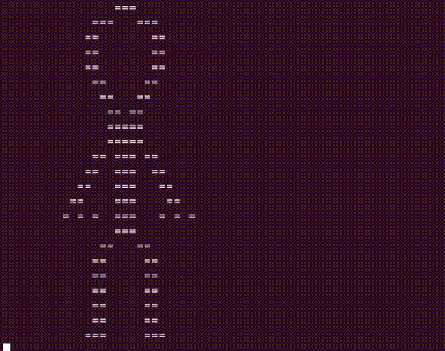

# Brumskii-Art2 

## Welcome!

This project is more of a part 2 of [Brumskii-Art](https://github.com/lil-brumski/Brumskii-Art).



Ubuntu/Debian

```bash
   $ apt install g++ cmake
```

```bash
   $ git clone https://github.com/lil-brumski/Brumskii-Art2.git
   $ cd Brumskii-Art2/
   $ mkdir build && cd build
   $ cmake .. && make
   $ ./Brumskii-Art2
```

Made by [lil-brumski](https://github.com/lil-brumski)